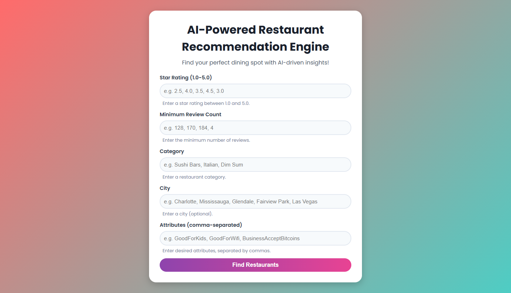

# AI-Powered Restaurant Recommendation Engine

**A web-based application built with FastAPI that provides personalized restaurant recommendations based on user preferences such as star rating, review count, category, city, and attributes (e.g., GoodForKids, OutdoorSeating). The application uses fuzzy matching for robust category and city searches, and a modern, eye-catching UI with a vibrant gradient background, rounded form elements, and smooth animations.**




## Features
- Personalized Recommendations: Filter restaurants by star rating (1.0-5.0), minimum review count, category (e.g., Sushi Bars, Italian), city (optional), and attributes (e.g., GoodForKids, BusinessAcceptsCreditCards).
- Fuzzy Matching: Handles misspellings or variations in city and category inputs using the fuzzywuzzy library.
- Responsive Design: Single-column form layout optimized for desktop and mobile, with a scrollable table for recommendations.
- Modern UI: Vibrant gradient background, heavily rounded inputs/buttons, Poppins font, and subtle animations (e.g., input scaling, button hover effects).
- Compact Form: Reduced height for a sleek, user-friendly experience with example placeholders (no default values).
- Accessibility: ARIA labels and high-contrast colors for screen reader compatibility and usability.

## Tech Stack
- Backend: FastAPI (Python), pandas, scikit-learn (MinMaxScaler), fuzzywuzzy
- Frontend: Jinja2 templates, HTML, CSS (with Poppins font from Google Fonts)
- Dependencies: Managed via requirements.txt (see Installation (#installation))

## Installation

1. **Clone the Repository:**
```
git clone https://github.com/jarif87/ai-powered-restaurant-recommendation-engine.git
cd ai-powered-restaurant-recommendation-engine
```
2. **Set Up a Virtual Environment (recommended):**

```
python -m venv venv
source venv/bin/activate  # On Windows: venv\Scripts\activate
```
3. **Install Dependencies:**
- Create a requirements.txt with the following content:
```
catboost==1.2.8
numpy==1.26.4
fastapi==0.115.13
Jinja2==3.1.6
uvicorn==0.34.3
pydantic==2.11.7
python-multipart
scikit-learn==1.2.2
cloudpickle==1.1.1
fuzzywuzzy
tabulate
```
4. **pip install -r requirements.txt**

## Prepare Data:
- Ensure a data.csv file is present in the project root with columns: name, address, city, stars, review_count, categories, attributes, is_open.
- The attributes column should contain dictionary-like strings (e.g., {'GoodForKids': True, 'OutdoorSeating': False}).

```
uvicorn main:app 
```
## Example inputs (placeholders guide users):
- Stars: e.g. 2.5, 4.0, 3.5, 4.5, 3.0
- Review Count: e.g. 128, 170, 184, 4
- Category: e.g. Sushi Bars, Italian, Dim Sum
- City: e.g. Charlotte, Mississauga, Glendale, Fairview Park, Las Vegas
- Attributes: e.g. GoodForKids, GoodForWifi, BusinessAcceptBitcoins

## Submit the Form:
- Click "Find Restaurants" to get up to 5 recommendations.
- The button shows "Searching..." during processing.

## View Results:
- Results display in a table with columns: Name, Address, City, Stars, Reviews, Categories.
- Warnings or messages appear if no exact matches are found (e.g., city mismatch or invalid category).

## File Structure

```
ai-powered-restaurant-recommendation-engine/
├── data.csv               # Dataset with restaurant details
├── main.py                # FastAPI backend logic
├── templates/
│   └── index.html         # HTML template with form and results
├── static/
│   └── style.css          # CSS for styling the frontend
├── requirements.txt       # Python dependencies
└── README.md              # Project documentation
```
## Design Highlights
- Vibrant Aesthetic: Red-to-teal gradient background (#ff6b6b to #4ecdc4) and purple-to-pink gradient buttons (#8e44ad to #e84393).
- Compact Form: Single-column layout with reduced padding (10px) and font sizes (0.95rem for inputs, 0.9rem for labels).
- Rounded Elements: 20px border-radius for inputs and buttons for a modern, soft look.
- Animations: Subtle scaling on input focus and button hover for interactivity.
- Responsive: Optimized for mobile with smaller fonts, padding, and a scrollable table.
- Accessibility: ARIA labels and high-contrast colors for usability.

